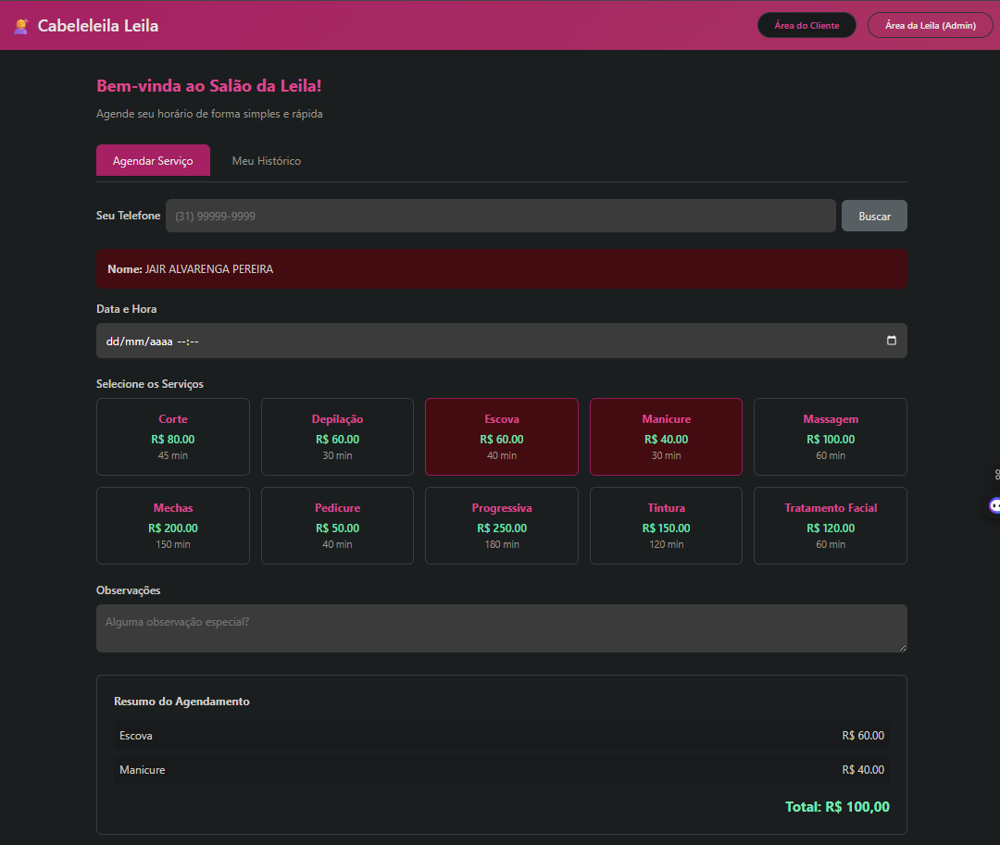
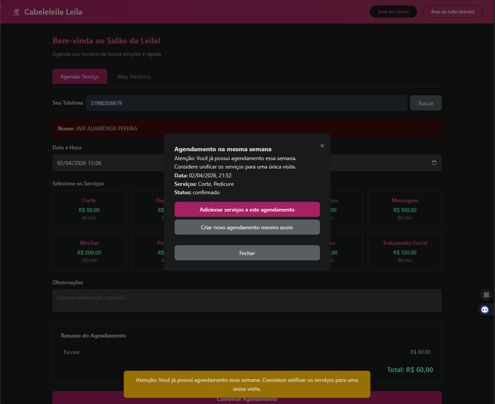
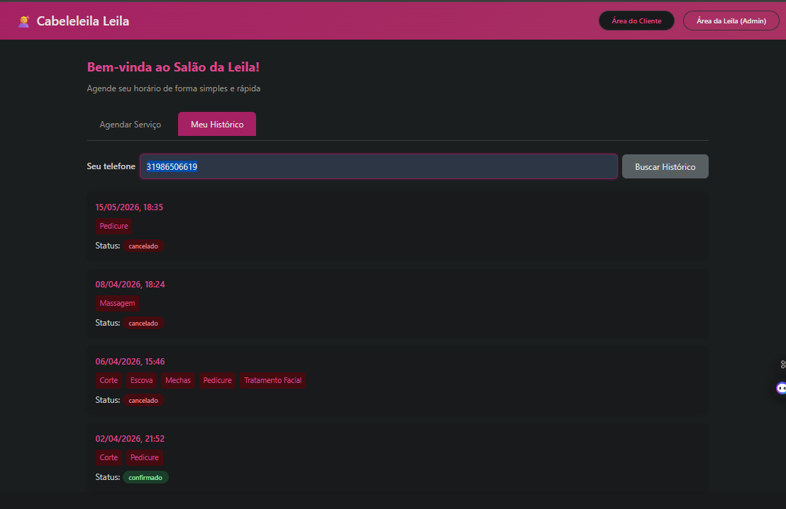
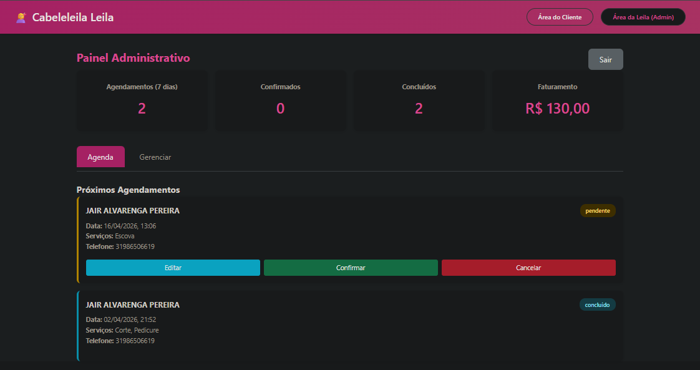
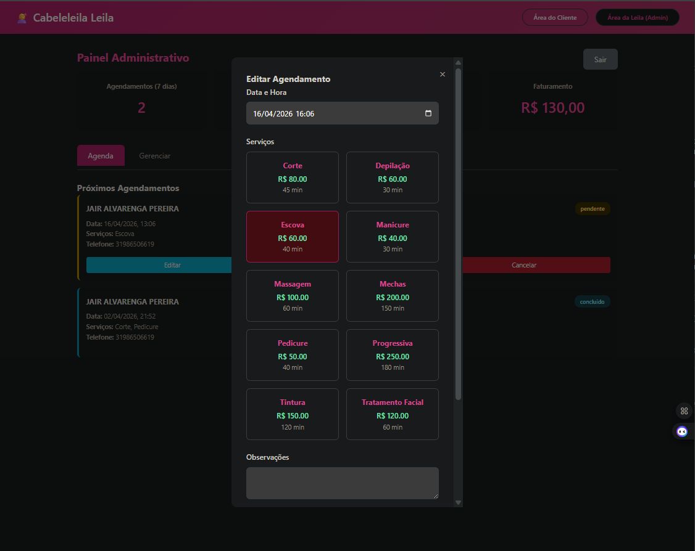

# 💇‍♀️ Cabeleleila Leila - Sistema de Agendamento

Sistema de agendamento online para Salão de Beleza, desenvolvido em Node.js com Express e PostgreSQL, seguindo o padrão MVC.


---

## 📋 Índice

- [Sobre o Projeto](#sobre-o-projeto)
- [Funcionalidades](#funcionalidades)
- [Tecnologias Utilizadas](#tecnologias-utilizadas)
- [Pré-requisitos](#pré-requisitos)
- [Instalação](#instalação)
- [Configuração do Banco de Dados](#configuração-do-banco-de-dados)
- [Executando o Projeto](#executando-o-projeto)
- [Estrutura do Projeto](#estrutura-do-projeto)
- [API Endpoints](#api-endpoints)
- [Guia de Uso](#guia-de-uso)
  - [Área do Cliente](#área-do-cliente)
  - [Área Administrativa](#área-administrativa)
- [Regras de Negócio](#regras-de-negócio)
- [Contribuição](#contribuição)
- [Licença](#licença)

---

## 📖 Sobre o Projeto

O **Cabeleleila Leila** é um sistema de agendamento para salão de beleza que permite:
- Clientes agendarem serviços online
- Administradora gerenciar agendamentos e serviços
- Dashboard com indicadores de desempenho

---

## ✨ Funcionalidades

### Área do Cliente
- 🔍 Busca de cliente por telefone
- 📝 Cadastro de novos clientes
- 📅 Agendamento de serviços com escolha de data/hora
- 🎯 Seleção múltipla de serviços
- 📊 Visualização do histórico de agendamentos
- ✏️ Edição de agendamentos pendentes (mais de 48h de antecedência)
- 🗑️ Exclusão de agendamentos pendentes (mais de 48h de antecedência)

### Área Administrativa
- 🔐 Login com senha protegida
- 📊 Dashboard com indicadores:
  - Total de agendamentos (7 dias)
  - Agendamentos confirmados
  - Agendamentos concluídos
  - Faturamento total
- 📅 Visualização da agenda
- ✏️ Edição completa de agendamentos (data, serviços, status)
- ✅ Confirmação de agendamentos
- ❌ Cancelamento de agendamentos
- 💅 Gerenciamento de serviços (CRUD)

### Regras de Negócio
- ⚠️ Alerta de unificação: se cliente tentar agendar na mesma semana, sugere unificar serviços
- ⏰ Validação de 48h: alterações só permitidas por telefone com menos de 48h de antecedência
- 🔒 Autenticação: área admin protegida por senha

---

## 🛠️ Tecnologias Utilizadas

- **Backend**: Node.js + Express
- **Banco de Dados**: PostgreSQL
- **Frontend**: HTML5, CSS3, JavaScript (Vanilla)
- **Bibliotecas**: pg, cors, dotenv

---

## 📌 Pré-requisitos

- Node.js 18+
- PostgreSQL 18+
- npm ou yarn

---

## 🚀 Instalação

1. **Clone o repositório:**
```bash
git clone https://github.com/seu-usuario/cabeleleila-leila.git
cd cabeleleila-leila
```

2. **Instale as dependências:**
```bash
npm install
```

---

## 🗄️ Configuração do Banco de Dados

1. **Crie o banco de dados:**
```sql
CREATE DATABASE salao_leila_db;
```

2. **Execute o script de criação das tabelas:**
```bash
psql -U postgres -d salao_leila_db -f schema.sql
```

3. **Configure as variáveis de ambiente:**

Crie um arquivo `.env` na raiz do projeto:
```env
PORT=3000
DB_HOST=localhost
DB_PORT=5433
DB_NAME=salao_leila_db
DB_USER=postgres
DB_PASSWORD=sua_senha
ADMIN_PASSWORD=admin123
```

> ⚠️ **Nota**: Configure a senha do PostgreSQL conforme sua instalação.

---

## ▶️ Executando o Projeto

```bash
npm start
```

O servidor akan executar em `http://localhost:3000`

---

## 📁 Estrutura do Projeto

```
cabeleleila-leila/
├── public/
│   ├── index.html      # Página principal
│   ├── style.css      # Estilos CSS
│   └── app.js         # JavaScript do frontend
├── src/
│   ├── config/
│   │   └── db.js      # Configuração do banco
│   ├── controllers/
│   │   ├── AgendamentoController.js
│   │   ├── ClienteController.js
│   │   └── ServicoController.js
│   ├── models/
│   │   ├── Agendamento.js
│   │   ├── Cliente.js
│   │   └── Servico.js
│   └── routes/
│       └── index.js   # Rotas da API
├── .env               # Variáveis de ambiente
├── .gitignore
├── package.json
├── schema.sql         # Script do banco de dados
└── server.js          # Arquivo principal
```

---

## 🗄️ Script do Banco de Dados

O arquivo `schema.sql` contém toda a estrutura do banco de dados. Você também pode copiar o script abaixo:

```sql
-- Schema Salão de Beleza Leila
-- PostgreSQL

-- Tabela de Clientes
CREATE TABLE IF NOT EXISTS clientes (
    id SERIAL PRIMARY KEY,
    nome VARCHAR(100) NOT NULL,
    telefone VARCHAR(20) NOT NULL,
    email VARCHAR(100),
    created_at TIMESTAMP DEFAULT CURRENT_TIMESTAMP
);

-- Tabela de Serviços
CREATE TABLE IF NOT EXISTS servicos (
    id SERIAL PRIMARY KEY,
    nome VARCHAR(100) NOT NULL,
    descricao TEXT,
    preco DECIMAL(10,2) NOT NULL,
    duracao_minutos INTEGER NOT NULL,
    created_at TIMESTAMP DEFAULT CURRENT_TIMESTAMP
);

-- Tabela de Agendamentos
CREATE TABLE IF NOT EXISTS agendamentos (
    id SERIAL PRIMARY KEY,
    cliente_id INTEGER REFERENCES clientes(id) ON DELETE CASCADE,
    data_hora TIMESTAMP NOT NULL,
    status VARCHAR(20) DEFAULT 'pendente',
    observacoes TEXT,
    created_at TIMESTAMP DEFAULT CURRENT_TIMESTAMP,
    updated_at TIMESTAMP DEFAULT CURRENT_TIMESTAMP
);

-- Tabela de serviços do agendamento (relação many-to-many)
CREATE TABLE IF NOT EXISTS agendamento_servicos (
    id SERIAL PRIMARY KEY,
    agendamento_id INTEGER REFERENCES agendamentos(id) ON DELETE CASCADE,
    servico_id INTEGER REFERENCES servicos(id) ON DELETE CASCADE
);

-- Dados Iniciais - Serviços
INSERT INTO servicos (nome, descricao, preco, duracao_minutos) VALUES
('Corte', 'Corte de cabelo tradicional', 80.00, 45),
('Escova', 'Escova modeladora', 60.00, 40),
('Tintura', 'Coloração completa', 150.00, 120),
('Mechas', 'Mechas californianas ou tradicionais', 200.00, 150),
('Progressiva', 'Alisamento brasileiro', 250.00, 180),
('Manicure', 'Esmaltação tradicional', 40.00, 30),
('Pedicure', 'Cuidados com os pés', 50.00, 40),
('Depilação', 'Depilação com cera', 60.00, 30),
('Massagem', 'Massagem relaxante', 100.00, 60),
('Tratamento Facial', 'Limpeza de pele', 120.00, 60)
ON CONFLICT DO NOTHING;

-- Dados Iniciais - Clientes
INSERT INTO clientes (nome, telefone, email) VALUES
('Maria Santos', '(31) 99999-0001', 'maria@email.com'),
('Ana Costa', '(31) 99999-0002', 'ana@email.com'),
('Juliana Silva', '(31) 99999-0003', 'juliana@email.com'),
('Carla Oliveira', '(31) 99999-0004', 'carla@email.com');

-- Índices para performance
CREATE INDEX IF NOT EXISTS idx_agendamentos_data ON agendamentos(data_hora);
CREATE INDEX IF NOT EXISTS idx_agendamentos_cliente ON agendamentos(cliente_id);
CREATE INDEX IF NOT EXISTS idx_agendamentos_status ON agendamentos(status);
```

### Como executar o script:

```bash
# Via linha de comando
psql -U postgres -d salao_leila_db -f schema.sql

# Ou via pgAdmin
# 1. Abra o pgAdmin
# 2. Clique com botão direito no banco de dados
# 3. Selecione "Query Tool"
# 4. Cole o script acima e execute (F5)
```

---

## 🌐 API Endpoints

### Clientes
| Método | Endpoint | Descrição |
|--------|----------|-----------|
| GET | `/api/clientes` | Lista todos os clientes |
| GET | `/api/clientes/telefone?telefone=` | Busca cliente por telefone |
| GET | `/api/clientes/:id` | Busca cliente por ID |
| POST | `/api/clientes` | Cria novo cliente |
| PUT | `/api/clientes/:id` | Atualiza cliente |
| DELETE | `/api/clientes/:id` | Deleta cliente |

### Serviços
| Método | Endpoint | Descrição |
|--------|----------|-----------|
| GET | `/api/servicos` | Lista todos os serviços |
| GET | `/api/servicos/:id` | Busca serviço por ID |
| POST | `/api/servicos` | Cria novo serviço |
| PUT | `/api/servicos/:id` | Atualiza serviço |
| DELETE | `/api/servicos/:id` | Deleta serviço |

### Agendamentos
| Método | Endpoint | Descrição |
|--------|----------|-----------|
| GET | `/api/agendamentos` | Lista todos os agendamentos |
| GET | `/api/agendamentos/:id` | Busca agendamento por ID |
| GET | `/api/agendamentos/cliente/:id` | Lista agendamentos do cliente |
| POST | `/api/agendamentos` | Cria novo agendamento |
| PUT | `/api/agendamentos/:id` | Atualiza agendamento (admin) |
| PATCH | `/api/agendamentos/:id/status` | Atualiza status |
| DELETE | `/api/agendamentos/:id` | Cancela agendamento |
| DELETE | `/api/agendamentos/cliente/:id` | Cliente exclui próprio agendamento |
| PUT | `/api/agendamentos/cliente/:id` | Cliente edita próprio agendamento |

### Dashboard
| Método | Endpoint | Descrição |
|--------|----------|-----------|
| GET | `/api/dashboard` | Dados do dashboard |

---

## 📖 Guia de Uso

### Área do Cliente

1. **Buscar cliente**: Digite o telefone e clique em "Buscar"
   - Se já existir, mostra os dados do cliente
   - Se não existir, mostra formulário para cadastro

2. **Agendar serviço**:
   - Selecione data e hora
   - Escolha um ou mais serviços
   - Adicione observações (opcional)
   - Confirme o agendamento

3. **Ver histórico**: Na aba "Meu Histórico", digite o telefone para ver agendamentos anteriores

4. **Editar/Excluir**: Agendamentos pendentes com mais de 48h podem ser editados ou excluídos

### Área Administrativa

1. **Login**: Clique em "Área da Leila (Admin)" e digite a senha (padrão: `admin123`)

2. **Dashboard**: Visualize indicadores de desempenho

3. **Agenda**: Veja os próximos agendamentos

4. **Gerenciar serviços**: Adicione, edite ou exclua serviços do salão

5. **Editar agendamentos**: Clique em "Editar" para alterar data, serviços, observações ou status

---

## ⚙️ Regras de Negócio

| Regra | Descrição |
|-------|-----------|
| Unificação de serviços | Se cliente tentar agendar na mesma semana, sistema sugere unificar |
| Validação 48h | Alterações em menos de 48h só por telefone |
| Status confirmado | Cliente não pode editar/cancelar agendamentos confirmados |
| Histórico | Histórico mostra todos os agendamentos do cliente |

---

## 🤝 Contribuição

1. Fork o projeto
2. Crie uma branch (`git checkout -b feature/nova-funcionalidade`)
3. Commit suas alterações (`git commit -m 'Adiciona nova funcionalidade'`)
4. Push para a branch (`git push origin feature/nova-funcionalidade`)
5. Crie um Pull Request

---

## 📝 Licença

Este projeto está sob a licença MIT.

---

## 📸 Screenshots

### Área do Cliente
| Tela de Login | Agendamento | Histórico |
|---------------|--------------|-----------|
|  |  |  |

### Área Administrativa
| Dashboard | Agenda |
|-----------|--------|
|  |  |

---

Desenvolvido com ❤️ para o Salão Cabeleleila Leila